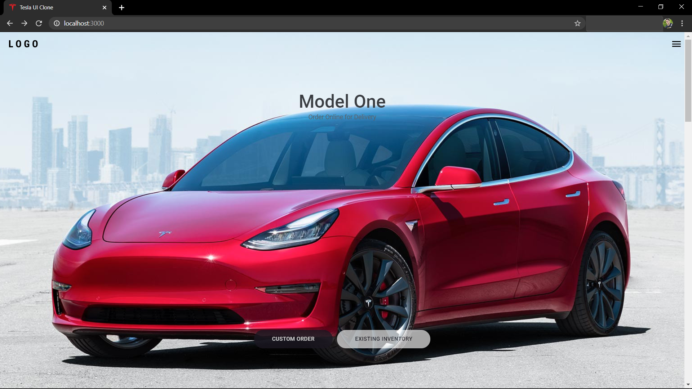

<p align="center">
  
</p>

<br>

## 🏁 Iniciando <a name = "getting_started"></a>
```
$ npm install or yarn install
$ npm start or yarn start
```

## ⛏️ Tecnologias Utilizadas <a name = "built_using"></a>

- 🔵 [TypeScript][typescript]
- ⚛️ [React][reactjs]
- 💅 [Styled-components]

## 🤔 Como contribuir <a name = "contribute"></a>

- Faça um fork desse repositório;
- Cria uma branch com a sua feature: `git checkout -b minha-feature`;
- Faça commit das suas alterações: `git commit -m 'feat: Minha nova feature'`;
- Faça push para a sua branch: `git push origin minha-feature`.

Feito por Gabriel Castilho 👋🏽 [Entre em contato!](https://www.linkedin.com/in/gabrielcastilhov/)

[typescript]: https://www.typescriptlang.org/
[reactjs]: https://reactjs.org
[styled-components]:https://styled-components.com/
